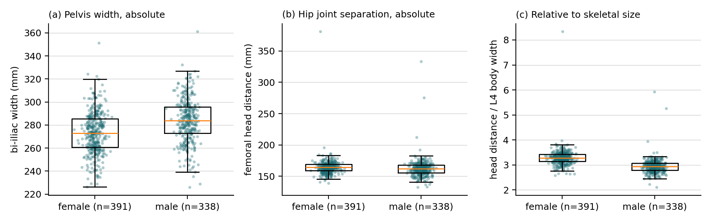

# Demo study: is the female pelvis relatively wider?

The shape every project here has, in one script: a question, a measurement from the
labels, a comparison, a figure, and a report whose numbers a script wrote.

## Run it

```bash
mamba activate osc
python examples/pelvic_width_dimorphism/measure_pelvic_width.py \
    --data /path/to/CTSpinoPelvic1K --out examples/pelvic_width_dimorphism/results --workers 8
# report and figure again from the CSV, without re-measuring (seconds):
python examples/pelvic_width_dimorphism/measure_pelvic_width.py --data ... --out ... --from-csv
```

`/path/to/CTSpinoPelvic1K` is the folder holding `labels/` and `manifest.json` (the
Hugging Face download, or the shared copy on the grid). About an hour on eight laptop
CPUs, because every record is a full label volume. On the grid: `mkdir -p logs && sbatch
templates/slurm_job.sh examples/pelvic_width_dimorphism/measure_pelvic_width.py --data ... --out ...`.

## What it measures

The textbook sexual dimorphism of the pelvis is a wider hip joint separation relative to
skeletal size. So the script measures, from the label volume alone:

- **femoral head distance**: the centre of each femoral head is the centroid of the
  medial-most 28 mm of the top 30 mm of the femur label (32 left, 33 right), and the
  distance between the two centres is the bicoxofemoral distance in millimetres;
- **outer width on that axis**: walk the line through the two head centres outward until
  it leaves each femur mask, and take the distance between the two exit points;
- **vertebral body width**: the left-right extent of the anterior 18 mm of the L4 label
  (23), or L5 when L4 is absent, as the skeletal-size reference;
- **relative separation**: femoral head distance divided by body width, the number the
  question is about;
- and the plain **bi-iliac width** of the two hip bones (30, 31), for comparison.

Axes are read from the affine, never assumed, so prone and supine records are measured
identically. Sex comes from `manifest.json`. Records with surgical hardware are excluded.

## What it found (v10 labels, 7 September 2026)

```
records measured: 802; analysed (no hardware, both femoral heads and a body width present): 791; female 391, male 338
bi-iliac width               female  272.98 +/- 17.81 (median 272.80)   male  283.86 +/- 18.86 (median 283.75) mm   Welch t =  -7.97, p = 6.4e-15, d = -0.59
femoral head distance        female  164.32 +/- 13.40 (median 164.20)   male  162.32 +/- 14.57 (median 162.05) mm   Welch t =   1.92, p = 5.6e-02, d = +0.14
outer width on that axis     female  217.48 +/- 15.79 (median 217.10)   male  227.94 +/- 16.43 (median 227.55) mm   Welch t =  -8.73, p = 1.9e-17, d = -0.65
vertebral body width (L4)    female   50.17 +/-  3.34 (median  49.90)   male   55.38 +/-  3.95 (median  54.90) mm   Welch t = -19.08, p = 4.8e-65, d = -1.43
head distance / body width   female    3.29 +/-  0.33 (median   3.28)   male    2.94 +/-  0.30 (median   2.93)    Welch t =  14.78, p = 2.1e-43, d = +1.09
```



The answer is yes, and the three panels tell the story in order. In absolute terms male
pelves are wider at the iliac crests (panel a). The femoral heads, though, sit the same
distance apart in both sexes, about 163 mm (panel b). Male skeletons are bigger, so the
same joint separation on a smaller skeleton is a relatively wider pelvis: divided by L4
body width the ratio is 3.29 in females against 2.94 in males, a large effect (Cohen's d
1.09) that separates the two distributions at a glance (panel c). The published figure for
this ratio is 3.95 against 3.48; ours is lower because the label-derived body width is a
few millimetres wider than a caliper endplate width, and the female to male ratio, 1.12
against 1.14, is what agrees.

Two lessons for your own project sit in this run. The first measurement we tried, bi-iliac
width over S1 width, said "no" with a small effect; the measurement decides which question
you asked. And the handful of far outliers in panels b and c are records where a femoral
head was not where the label said (a fragment or a prosthesis); the medians do not move,
but a report should say they are there.

## Make it yours

Change one thing at a time and rerun. Divide by S1 width (29) instead of L4 and you have
a sacral reference. Measure the outer width instead of the head distance and you have the
acetabular span. Group by `position` instead of `sex` to check that a distance does not
depend on posture. Group by `has_l6` and you have a transitional-anatomy question. Ask
Claude Code to make the change and to explain the two lines it edited.

## Files

- `measure_pelvic_width.py` — the whole study
- `results/pelvic_width.csv` — one row per record: case, sex, age, position, hardware, bi-iliac mm, femoral head distance mm, outer width mm, body width mm, body level, relative separation
- `results/report.txt` — the numbers above, written by the script
- `results/pelvic_width.png` — the figure
